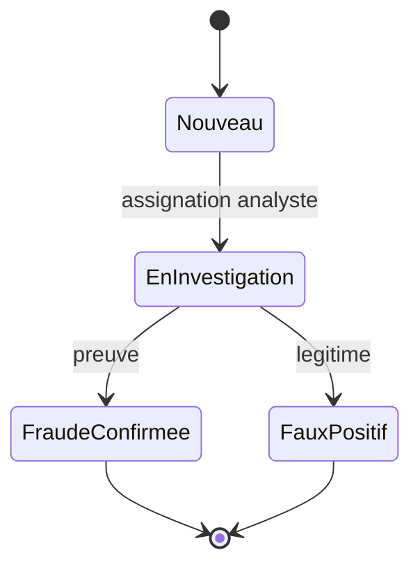

# Aegis — Blueprint Entreprise

> Plateforme de prévention du crime financier. Ce document décrit la vision
> produit, l'architecture, la conformité et la trajectoire de mise à l'échelle.
> Le coeur noté du hackathon (`detect_fraud`) reste intact et constitue le
> moteur deterministe auditable de la plateforme.

---

## 1. Du script au produit

Le hackathon demande « une fonction qui signale des transactions suspectes ».
Aegis répond à la vraie question d'une banque ou d'une institution
internationale : **comment exploiter cette détection en production, de façon
performante, explicable, conforme et opérable ?**

Principe directeur (posture de consultant) :

> **Un coeur deterministe et explicable (exigence réglementaire)
> + une augmentation ML (performance)
> + un humain dans la boucle (responsabilité).**

---

## 2. Les enjeux à grande échelle

| Enjeu | Pourquoi c'est critique | Réponse d'Aegis |
|---|---|---|
| **Pertes financières** | Chaque fraude non détectée = perte sèche + remboursement | Détection multi-couches, priorisation par risque |
| **Réputation / confiance** | Un faux positif humilie un client honnête (carte refusée) | On optimise la **précision**, pas seulement le rappel |
| **Conformité** | LCB-FT/AML, PSD2, RGPD, PCI-DSS | Décisions tracées + explicables + PII pseudonymisées |
| **Risque modèle** | Biais, dérive, boîte noire = risque juridique | Reason codes systématiques, coeur deterministe prioritaire |
| **Opérationnel** | L'analyste décide en quelques secondes | File priorisée, explicabilité immédiate, dossiers |

---

## 3. Architecture

```mermaid
flowchart LR
  ingest["Ingestion (CSV / flux simule)"] --> quality["Qualite & PII"]
  quality --> orchestrator["Orchestrateur de decision"]
  subgraph brain [Cerveau de detection]
    rules["Regles deterministes (auditable)"]
    ml["ML anomalie (IsolationForest / fallback numpy)"]
    graph["Graphe reseaux (union-find)"]
  end
  orchestrator --> brain
  brain --> decision["Score + reason codes + verdict"]
  decision --> cases["Dossiers (SQLite)"]
  decision --> audit["Piste d'audit immuable"]
  cases --> feedback["Boucle de feedback / metriques"]
  feedback --> orchestrator
  decision --> ui["Consoles multi-persona"]
```

### Cartographie du code

| Module | Rôle | Dépendances |
|---|---|---|
| `fraud_detection.py` | **Coeur noté, inchangé** : `detect_fraud`, `load_transactions` | stdlib |
| `aegis/config.py` | Politique de risque centralisée (zéro nombre magique) | stdlib |
| `aegis/engine/orchestrator.py` | Fusion règles + ML + graphe -> décision + reason codes | numpy |
| `aegis/ml/anomaly.py` | Anomalie non supervisée (IsolationForest + repli chi-2) | numpy, sklearn* |
| `aegis/graph/rings.py` | Réseaux de fraude (union-find, Python pur) | stdlib |
| `aegis/casemgmt/store.py` | Dossiers + audit + feedback (SQLite) | stdlib |
| `aegis/data/ingest.py` | Ingestion, flux simulé, PII, qualité | stdlib |
| `aegis/ui/` | Design system + 6 consoles persona | streamlit |

\* `scikit-learn` optionnel : sans lui, repli numpy automatique.

---

## 4. Le cerveau de détection (3 couches)

1. **Coeur deterministe** (source de vérité notée) : montant nul/négatif,
   écart à la médiane robuste du client, **voyage géographiquement impossible**
   (distance de Haversine vs vitesse max), rafales, champs manquants.
   Reproductible et 100 % explicable — c'est ce qui passe devant un régulateur.

2. **ML non supervisé** : un `IsolationForest` apprend la *normalité* de chaque
   client sur des features contextuelles (montant normalisé, écart à la médiane,
   heure cyclique, carte absente, rareté du pays, vélocité, nouveauté de devise).
   Capte l'atypique que les règles ne codent pas. **Repli numpy** (distance de
   Mahalanobis -> probabilité via loi du chi-2) si sklearn est absent : l'app ne
   plante jamais.

3. **Graphe de réseaux** : `union-find` relie les comptes partageant un même
   point de cashout (marchand + pays) dans une fenêtre temporelle resserrée, et
   révèle les **anneaux de fraude** invisibles transaction par transaction.

**Fusion (orchestrateur)** : score pondéré + planchers métier. Le verdict
deterministe garde la priorité réglementaire ; le graphe et le ML peuvent
**déclencher seuls** une alerte (un réseau ou une anomalie forte). Chaque
décision porte ses **reason codes** lisibles (droit à l'explication).

---

## 5. Cycle de vie opérationnel



- Chaque alerte devient un **dossier** persisté (statut, assignation, notes).
- **Piste d'audit immuable** (append-only) : qui / quoi / quand / pourquoi.
- **Boucle de feedback** : les dispositions analystes alimentent les métriques
  (précision, taux de faux positifs) qui pilotent l'ajustement des seuils.

---

## 6. Conformité, sécurité, non-fonctionnel

| Domaine | Mise en oeuvre actuelle | Cible production |
|---|---|---|
| **RGPD** | Pseudonymisation des identifiants (hash salé) dans UI et exports | Coffre de secrets (KMS), minimisation, durée de rétention |
| **AML / LCB-FT** | Piste d'audit + reason codes + export réglementaire | Reporting TRACFIN/STR automatisé |
| **PSD2 (SCA)** | Score de risque exploitable pour step-up d'authentification | Décision temps réel < 100 ms dans le flux de paiement |
| **PCI-DSS** | Aucune donnée carte brute stockée | Tokenisation, segmentation réseau |
| **Gouvernance modèle** | Coeur deterministe prioritaire, ML explicable, seuils versionnés | Suivi de dérive (drift), réentraînement contrôlé, model cards |
| **Robustesse** | Fallbacks partout, données sales tolérées, ne plante jamais | Tests de charge, chaos engineering |

---

## 7. Mise à l'échelle (trajectoire)

| Aujourd'hui (démo) | Étape 2 | Cible entreprise |
|---|---|---|
| CSV + flux rejoué | Connecteurs batch + API | **Streaming Kafka** temps réel |
| SQLite local | PostgreSQL | Datastore distribué + data lake |
| Analyse en mémoire | Service de scoring | Microservices + autoscaling |
| Modèle entraîné à la volée | Registre de modèles | MLOps (CI/CD modèle, drift, A/B) |
| Mono-poste | Multi-utilisateur | RBAC, SSO, multi-tenant |

**Latence cible** : scoring < 100 ms par transaction pour autoriser/refuser dans
le flux de paiement. **Disponibilité** : 99,95 %. **Résidence des données** :
régionalisée (UE).

---

## 8. KPIs de pilotage

- **Pertes évitées** (€) et exposition à risque par pays / motif.
- **Taux de détection** et **taux de faux positifs** (qualité décisionnelle).
- **Précision** issue de la boucle de feedback analystes.
- **Délai moyen de traitement** d'un dossier.

---

## 9. Garanties de compatibilité hackathon

- `detect_fraud` et `load_transactions` **inchangés** -> **11/11 tests publics**
  et `data/sample_expected.json` préservés.
- `streamlit run app.py` reste la commande unique du jury.
- Nouvelles dépendances minimales ; la CI n'importe pas la couche ML.
